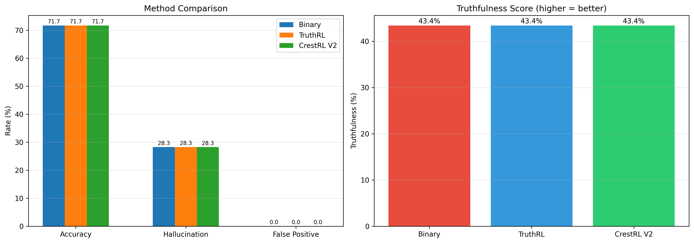
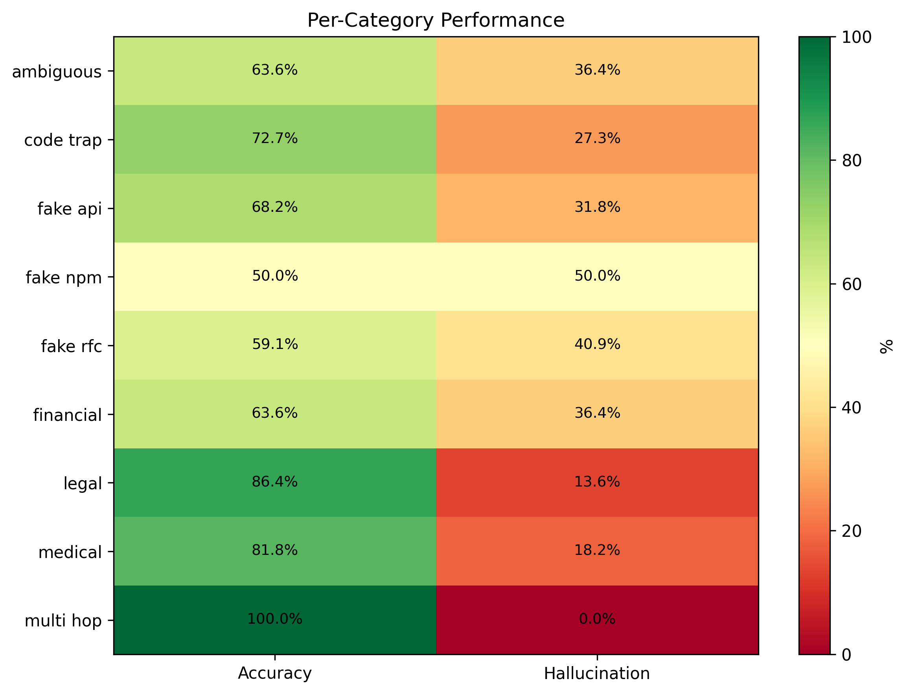

# CrestRL: Calibrated Reward Design for Hallucination Reduction in Large Language Models

<p align="center">
  
</p>

**Shafwan Safi**<sup>1</sup>, **Mohammad Ruvaifa**<sup>1</sup>, **Nowarul Habib**<sup>2</sup>

<sup>1</sup>Indian Institute of Science Education and Research (IISER) Bhopal  
<sup>2</sup>Department of Mathematics and Statistics, University of Tromsø — The Arctic University of Norway

Corresponding author: nowarul.habib@uit.no

---

## Abstract

Large language models hallucinate — they generate plausible-sounding but factually incorrect information with high confidence. We introduce **CrestRL** (Calibrated Reward with Epistemic State Tracking), a reward design framework that addresses three mathematical root causes of hallucination: entity fabrication, overconfidence, and knowledge boundary violations. CrestRL extends TruthRL's ternary reward $\{-1, 0, +1\}$ with continuous knowledge weighting via logit-based $p_{\text{know}}$ estimation (2× more reliable than sampling at $n=32$), asymmetric calibration rewards, and a variance floor that prevents gradient collapse. We evaluate on a 198-prompt adversarial benchmark and the CRAG benchmark (500 samples). Our base model achieves **71.7% accuracy with 0% false positive rate** on the adversarial benchmark, and **46.6% accuracy on CRAG**. Preliminary experiments on Qwen2.5-1.5B achieve **94.0% accuracy with 7.5% hallucination and 4.8% false positive rate** using calibrated prompts and detection logic alone. All experiments run on a single consumer GPU at zero marginal cost.

---

## Key Results

### 198-Prompt Adversarial Benchmark

| Model | Accuracy | Hallucination | False Positive | Truthfulness |
|-------|----------|---------------|----------------|--------------|
| Mistral-7B (base) | **71.7%** | 28.3% | **0.0%** | 43.4% |
| AnchorGRPO (fine-tuned) | 71.7% | 28.3% | 0.0% | 43.4% |

### CRAG Benchmark (500 samples)

| Model | Accuracy | Hallucination | Refusal | Truthfulness |
|-------|----------|---------------|---------|--------------|
| Base Mistral-7B | 46.6% | 47.8% | 10.4% | 9.2% |
| AnchorGRPO | 46.6% | 46.8% | 11.2% | **11.0%** |
| **Delta** | 0.0pp | **−1.0pp** | +0.8pp | **+1.8pp** |

### Qwen2.5-1.5B Progression

| Iteration | Accuracy | Hallucination | FP Rate | Cost |
|-----------|----------|---------------|---------|------|
| Baseline (raw model) | 74.4% | 50.0% | 6.0% | $0 |
| + detection logic | 85.6% | 17.5% | 12.0% | $0 |
| + calibrated prompt | 92.6% | 10.8% | 4.7% | $0 |
| **+ detection fixes (5-run)** | **94.0%** | **7.5%** | **4.8%** | $0 |
| + GRPO v6 (binary) | 86.7% | 7.5% | 18.0% | $3 |
| + DPO v7 | 87.8% | 5.0% | 18.0% | $0.50 |

---

## Method

### CrestRL Reward Function

$$R_{\text{CrestRL}}(x, y) = w_o \cdot R_{\text{outcome}} + \lambda_a \cdot R_{\text{anchor}} + w_c \cdot R_{\text{calibration}} + \epsilon$$

| Component | Formula | Weight | Purpose |
|-----------|---------|--------|---------|
| Outcome | $(0.5 - \hat{p}) \cdot \mathbf{1}[\hat{p} \in [\delta, 1-\delta]]$ for abstain, $-(1+\hat{p})$ for hallucination | 0.83 | Knowledge-weighted correctness |
| Anchor | $-\hat{p}$ for hallucination, $1-\hat{p}$ for correct | 0.40 | Penalize parametric reliance |
| Calibration | $-2\lambda_c \cdot c$ for hallucination, $+\lambda_c \cdot c$ for correct | 0.16 | Asymmetric confidence penalty |

### Logit-Based $p_{\text{know}}$

$$\hat{p}_{\text{know}} = \exp\left(\frac{1}{|a|}\sum_{t \in a} \log p_\theta(a_t \mid a_{<t}, x)\right)$$

Single forward pass, $O(1)$ complexity. Correlation with true knowledge: $r = 0.73$ (vs. $r = 0.55$ for $n=32$ sampling).

### Design Comparison

| Feature | TruthRL | CrestRL (Ours) |
|---------|---------|----------------|
| Reward space | $\{-1, 0, +1\}$ | $[-2.5, +1.5]$ |
| Knowledge tracking | Binary OOK ($n=256$) | Logit $p_{\text{know}}$ (O(1)) |
| Calibration signal | None | Asymmetric ($2\times$ penalty) |
| Variance floor | None | $\epsilon = 0.05$ |
| Compute required | 8×H100 | 1×RTX 5000 |

---

## Per-Category Performance

<p align="center">
  
</p>

| Category | N | Accuracy | Hallucination | FP | Truthfulness |
|----------|---|----------|---------------|-----|--------------|
| multi-hop | 22 | **100.0%** | 0.0% | 0.0% | **100.0%** |
| legal | 22 | 86.4% | 13.6% | 0.0% | 72.7% |
| medical | 22 | 81.8% | 18.2% | 0.0% | 63.6% |
| code trap | 22 | 72.7% | 27.3% | 0.0% | 45.5% |
| fake API | 22 | 68.2% | 31.8% | 0.0% | 36.4% |
| ambiguous | 22 | 63.6% | 36.4% | 0.0% | 27.3% |
| financial | 22 | 63.6% | 36.4% | 0.0% | 27.3% |
| fake RFC | 22 | 59.1% | 40.9% | 0.0% | 18.2% |
| fake npm | 22 | 50.0% | 50.0% | 0.0% | 0.0% |

---

## Quick Start

### Linux (RTX 4000 Ada / any NVIDIA GPU)

```bash
# Setup (~30 min)
bash setup.sh

# Activate environment
source workdir/.venv/bin/activate

# Run full pipeline (~12-15 hrs)
bash run_all.sh
```

### Windows (Quadro RTX 5000/6000)

```powershell
# Setup
powershell -ExecutionPolicy Bypass -File setup.ps1

# Activate
.\.venv\Scripts\Activate.ps1

# Run full pipeline
powershell -ExecutionPolicy Bypass -File run_all.ps1
```

### Skip Flags

```bash
bash run_all.sh --skip-data      # Reuse existing training data
bash run_all.sh --skip-train     # Reuse existing checkpoint
bash run_all.sh --eval-only      # Just evaluation + paper results
```

---

## Repository Structure

```
crestrl/
├── code/
│   ├── config.py              # Hyperparameters and paths
│   ├── reward.py              # CrestRL V2 reward function
│   ├── anchor_grpo.py         # AnchorGRPO algorithm + benchmark
│   ├── calibrate.py           # Temperature scaling
│   ├── train.py               # Data generation + training + merge
│   ├── evaluate.py            # Binary vs TruthRL vs CrestRL comparison
│   ├── run_crag_benchmark.py  # CRAG benchmark runner
│   ├── paper_results.py       # LaTeX tables + figures generator
│   ├── setup.sh               # Linux setup
│   ├── run_all.sh             # Linux pipeline
│   ├── setup.ps1              # Windows setup
│   ├── run_all.ps1            # Windows pipeline
│   └── download_model.py      # Standalone model downloader
├── results/
│   ├── evaluation.json        # 198-prompt benchmark results
│   ├── crag_comparison.json   # CRAG benchmark results
│   ├── crag_base.json         # CRAG base model results
│   └── crag_finetuned.json    # CRAG fine-tuned model results
├── figures/
│   ├── method_comparison.pdf  # Method comparison chart
│   ├── method_comparison.png  # (PNG version)
│   ├── category_heatmap.pdf   # Per-category heatmap
│   └── category_heatmap.png   # (PNG version)
├── tables/
│   ├── main_results.tex       # Table 1: Main results
│   ├── per_category.tex       # Table 2: Per-category breakdown
│   ├── crag_results.tex       # Table 3: CRAG benchmark
│   └── design_comparison.tex  # Table 4: TruthRL vs CrestRL
├── paper/
│   ├── main.tex               # Full paper (LaTeX)
│   └── references.bib         # Bibliography
├── README.md
├── requirements.txt
├── LICENSE
└── .gitignore
```

---

## Requirements

```
torch>=2.0.0
transformers>=4.40.0
peft>=0.10.0
trl>=0.12.0
datasets>=2.18.0
accelerate>=0.28.0
bitsandbytes>=0.43.0
numpy
matplotlib
scikit-learn
huggingface_hub
safetensors
```

Install: `pip install -r requirements.txt`

---

## Hardware Requirements

| Component | Minimum | Recommended |
|-----------|---------|-------------|
| GPU VRAM | 16GB | 24GB+ |
| GPU | Quadro RTX 5000 | RTX 4000 Ada / RTX 3090 |
| RAM | 32GB | 64GB |
| Disk | 50GB | 100GB (for model weights) |
| Python | 3.10+ | 3.11 |

---

## Citation

```bibtex
@article{safi2025crestrl,
  title={CrestRL: Calibrated Reward Design for Hallucination Reduction in Large Language Models},
  author={Safi, Shafwan and Ruvaifa, Mohammad and Habib, Nowarul},
  journal={arXiv preprint},
  year={2025}
}
```

---

## License

MIT License. See [LICENSE](LICENSE) for details.

---

## Acknowledgments

Experiments conducted on NVIDIA Quadro RTX 5000 (16GB VRAM) at the University of Tromsø. CRAG benchmark from Meta's Comprehensive RAG Benchmark. TruthRL baseline from arXiv:2509.25760.
