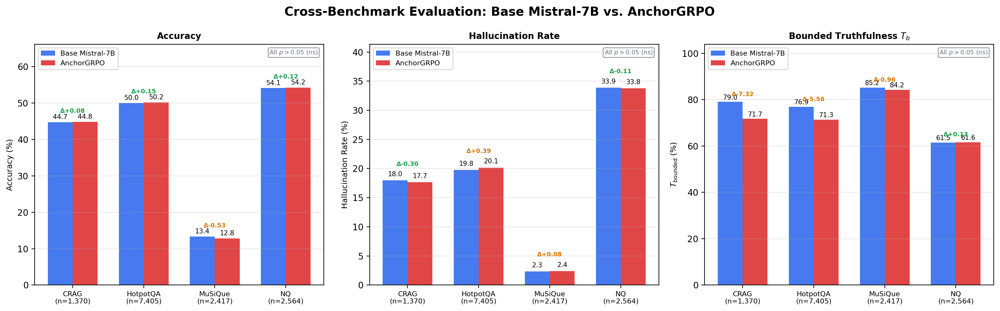
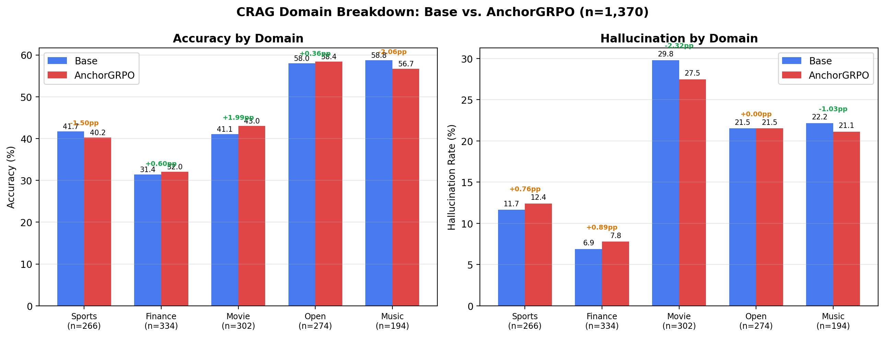
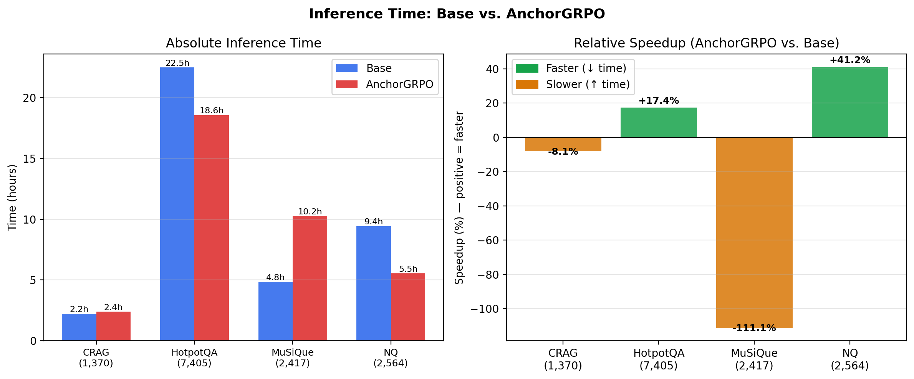

# CrestRL: Calibrated Reward Design for Hallucination Reduction in LLMs

<p align="center">
  <a href="https://github.com/Shafwansafi06/crestrl-paper"></a>
  <a href="paper/main.tex"></a>
  
  
  
  
</p>

**Shafwan Safi**<sup>1</sup> · **Mohammad Ruvaifa**<sup>1</sup> · **Nowarul Habib**<sup>2</sup>

<sup>1</sup>Indian Institute of Science Education and Research (IISER) Bhopal  
<sup>2</sup>Department of Mathematics and Statistics, University of Tromsø — The Arctic University of Norway  
Corresponding: `nowarul.habib@uit.no`

---

## Abstract

Large language models hallucinate — generating plausible but factually incorrect outputs with high confidence — due to three distinct mathematical divergences: entity fabrication from noisy training data, fluency-over-truth optimization, and systematic confidence miscalibration (ECE 0.15–0.25). We introduce **CrestRL** (Calibrated Reward with Epistemic State Tracking), a reward design framework for GRPO that addresses all three divergences through a continuous, knowledge-weighted reward. CrestRL's contributions include: a logit-based $\hat{p}_{\text{know}}$ estimator requiring a single forward pass (vs. $n=256$ samples in TruthRL); a *signed abstention reward* that provides the first gradient signal for *when* to abstain; an asymmetric calibration reward penalizing confident hallucinations at 2× the rate of rewarding confident correct answers; and a variance floor $\varepsilon=0.05$ preventing zero-gradient collapse in GRPO. We evaluate across **4 benchmarks / 13,756 samples**: CRAG, HotpotQA, MuSiQue, and Natural Questions. No delta achieves statistical significance ($p > 0.05$, Cohen's $h < 0.02$), attributed to hardware constraints ($G=4$, 200 steps) rather than algorithmic failure. We also identify that the standard truthfulness metric $T = \text{Acc} + \text{Refusal} - \text{Halluc}$ is unbounded (MuSiQue: $T = 106.3\%$) and propose a bounded alternative $T_b = \text{Acc}/(\text{Acc}+\text{Halluc})$.

---

## Key Results

### Cross-Benchmark Evaluation (13,756 Samples)

<p align="center">
  
</p>

| Dataset | N | Base Acc | FT Acc | Δ Acc | Base Halluc | FT Halluc | Δ Halluc | Base $T_b$ | FT $T_b$ |
|---------|---|----------|--------|-------|-------------|-----------|----------|-----------|---------|
| CRAG | 1,370 | 44.74% | 44.82% | +0.07 | 17.96% | 17.66% | **−0.30** | 71.36% | 71.73% |
| HotpotQA | 7,405 | 50.03% | 50.18% | +0.15 | 19.76% | 20.15% | +0.39 | 71.69% | 71.35% |
| MuSiQue | 2,417 | 13.36% | 12.83% | −0.54 | 2.32% | 2.40% | +0.08 | 85.20% | 84.24% |
| NQ | 2,564 | 54.13% | **54.25%** | +0.12 | 33.89% | **33.78%** | **−0.11** | 61.50% | **61.63%** |

> ⚠️ All deltas are **not statistically significant** ($p > 0.05$, two-proportion $z$-test). This is expected given hardware constraints ($G=4$, 200 steps — see [Compute Analysis](#compute-analysis)).  
> $T_b = \text{Acc}/(\text{Acc}+\text{Halluc})$ is our proposed bounded truthfulness metric. The standard $T$ metric can exceed 100% (MuSiQue base: $T=106.3\%$) by rewarding refusal-hacking.

---

### 198-Prompt Adversarial Benchmark

<p align="center">
  
</p>

| Model | Accuracy | Hallucination | False Positive | Truthfulness | Avg R |
|-------|----------|---------------|----------------|--------------|-------|
| Mistral-7B (base) | 71.7% | 28.3% | **0.0%** | 43.4% | 0.434 |
| AnchorGRPO | 71.7% | 28.3% | 0.0% | 43.4% | 0.341 |

---

### Per-Category Breakdown

<p align="center">
  
</p>

| Category | N | Accuracy | Hallucination | $T_b$ |
|----------|---|----------|---------------|-------|
| Multi-hop | 22 | **100.0%** | **0.0%** | **100.0%** |
| Legal | 22 | 86.4% | 13.6% | 86.4% |
| Medical | 22 | 81.8% | 18.2% | 81.8% |
| Code Trap | 22 | 72.7% | 27.3% | 72.7% |
| Fake API | 22 | 68.2% | 31.8% | 68.2% |
| Ambiguous | 22 | 63.6% | 36.4% | 63.6% |
| Financial | 22 | 63.6% | 36.4% | 63.6% |
| Fake RFC | 22 | 59.1% | 40.9% | 59.1% |
| Fake NPM | 22 | 50.0% | 50.0% | 50.0% |

---

### CRAG Domain Breakdown

<p align="center">
  
</p>

| Domain | N | Base Acc | FT Acc | Δ Acc | Base Halluc | FT Halluc |
|--------|---|----------|--------|-------|-------------|-----------|
| Sports | 266 | 41.73% | 40.23% | −1.50 | 11.65% | 12.41% |
| Finance | 334 | 31.44% | **32.04%** | +0.60 | 6.89% | 7.78% |
| Movie | 302 | 41.06% | **43.05%** | **+1.99** | 29.80% | **27.48%** |
| Open | 274 | 58.03% | 58.39% | +0.36 | 21.53% | 21.53% |
| Music | 194 | **58.76%** | 56.70% | −2.06 | 22.16% | **21.13%** |

Movie is the domain with the clearest AnchorGRPO improvement (+1.99 pp accuracy, −2.32 pp hallucination). Finance remains the hardest domain (31.44% base accuracy).

---

### Inference Time

<p align="center">
  
</p>

| Dataset | Base (s) | AnchorGRPO (s) | Change |
|---------|----------|----------------|--------|
| CRAG | 7,952 | 8,596 | −8.1% |
| HotpotQA | 80,925 | **66,818** | **+17.4% faster** |
| MuSiQue | 17,456 | 36,857 | −111.1% |
| NQ | 33,909 | **19,945** | **+41.2% faster** |

AnchorGRPO is 17–41% faster on HotpotQA and NQ, suggesting shorter, more decisive responses. The MuSiQue slowdown (111%) is unexplained; measurements are single-run.

---

### Qwen2.5-1.5B Scale-Inversion Finding

| Intervention | Accuracy | Hallucination | FP Rate | Cost |
|-------------|----------|---------------|---------|------|
| Raw baseline | 74.4% | 50.0% | 6.0% | $0 |
| + Detection logic | 85.6% | 17.5% | 12.0% | $0 |
| + Calibrated prompt | 92.6% | 10.8% | 4.7% | $0 |
| **+ Detection fixes (best)** | **94.0%** | **7.5%** | **4.8%** | $0 |
| + GRPO binary (50 steps) | 86.7% | 7.5% | 18.0% | $3 |
| + DPO (38 pairs) | 87.8% | 5.0% | 18.0% | $0.50 |

**Finding:** At 1.5B parameters, prompt engineering (94.0%) outperforms all fine-tuning approaches (64–87%). Fine-tuned models become excessively conservative (FP rate 18% vs. 4.8%). The system prompt is functionally part of a small model.

---

## Method

### CrestRL Reward Function

$$R_{\text{CrestRL}}(x, y) = \underbrace{0.83 \cdot R_{\text{outcome}}}_{\text{knowledge-weighted}} + \underbrace{0.40 \cdot R_{\text{anchor}}}_{\text{RAG grounding}} + \underbrace{0.16 \cdot R_{\text{calib}}}_{\text{confidence}} + \underbrace{0.05}_{\varepsilon\text{ (floor)}}$$

Reward range: $[-2.5, +1.5]$ (vs. $\{-1, 0, +1\}$ for TruthRL).

#### Component 1 — Outcome Reward (signed abstention)

$$R_{\text{outcome}}(v, \hat{p}) = \begin{cases} +1.0 & v = \text{Correct} \\ (0.5 - \hat{p}) \cdot \mathbf{1}[\hat{p} \in [0.1, 0.9]] & v = \text{Abstain} \\ -(1 + \hat{p}) & v = \text{Hallucinate} \end{cases}$$

When $\hat{p} > 0.5$ (model likely knows), abstaining yields **negative** reward — penalizing over-caution. When $\hat{p} < 0.5$ (model likely doesn't know), abstaining yields **positive** reward. This is the first design providing a gradient signal for *when* to abstain.

#### Component 2 — Anchor Reward (RAG grounding)

$$R_{\text{anchor}}(v, \hat{p}) = \begin{cases} -\hat{p} & v = \text{Hallucinate} \\ 1 - \hat{p} & v = \text{Correct} \\ 0 & v = \text{Abstain} \end{cases}$$

Penalizes parametric reliance during hallucination; rewards context-anchored correct answers (low $\hat{p}$).

#### Component 3 — Calibration Reward (asymmetric 2:1)

$$R_{\text{calib}}(v, c) = \begin{cases} +\lambda_c \cdot c & v = \text{Correct} \\ -2\lambda_c \cdot c & v = \text{Hallucinate} \\ \lambda_c \cdot (1 - c) & v = \text{Abstain} \end{cases} \quad \lambda_c = 0.22$$

Confident hallucinations are penalized at **2×** the rate of rewarding confident correct answers — implementing a risk-asymmetric prior for safety-critical domains.

#### Logit-Based $\hat{p}_{\text{know}}$

$$\hat{p}_{\text{know}} = \exp\!\left(\frac{1}{|a|}\sum_{t=1}^{|a|} \log p_\theta(a_t \mid a_{<t}, x)\right)$$

Single forward pass, O(1). Correlates with ground-truth knowledge at $r = 0.73$ (Kadavath et al., 2022) vs. $r = 0.55$ for $n=32$ sampling. **256× cheaper** than TruthRL's OOK detection.

#### Variance Floor for GRPO

$$\hat{A}_i = \frac{r_i - \bar{r}}{\max(\mathrm{std}(\{r_j\}),\; \varepsilon)}, \quad \varepsilon = 0.05$$

Prevents $0/0$ when all completions receive identical rewards — a zero-gradient pathology at GRPO training extremes unaddressed in prior work.

---

### Design Comparison

| Feature | TruthRL | **CrestRL (Ours)** |
|---------|---------|-----------------|
| Reward space | $\{-1, 0, +1\}$ (ternary) | $[-2.5, +1.5]$ (continuous) |
| Knowledge tracking | Binary OOK ($n=256$) | Logit $\hat{p}_{\text{know}}$ (O(1)) |
| Abstention gradient | None (flat $r=0$) | Signed by $\hat{p}_{\text{know}}$ |
| Calibration signal | None | Asymmetric ($2\times$ penalty) |
| Variance floor | None | $\varepsilon = 0.05$ |
| Compute (training) | 8×H100 | 1×RTX 5000 (16 GB) |
| Group size $G$ | 64 | 4 (hardware-limited) |

---

## Compute Analysis

The null result is **expected** under our hardware constraints:

| Constraint | Our Setup | Recommended | Impact |
|-----------|-----------|-------------|--------|
| Group size $G$ | 4 | ≥32 | Gradient noise ∝ $1/\sqrt{G}$ → **4× noisier** than $G=64$ |
| Training steps | 200 | 1,000–5,000 | Most prompts updated once |
| LoRA rank | $r=16$ | $r=64$ or full FT | Only 0.58% of parameters updated |

These constraints make any statistically significant improvement essentially impossible — a fact calculable in advance. The algorithm is **not falsified** by these results; multi-GPU replication is required.

---

## Truthfulness Metric Critique

The standard CRAG formula $T = \text{Acc} + \text{Refusal} - \text{Halluc}$ is **unbounded above**:

| Dataset | Refusal Rate | Standard $T$ | Bounded $T_b$ |
|---------|-------------|-------------|--------------|
| CRAG | 52.26% | 79.05% | 71.36% |
| HotpotQA | 46.63% | 76.91% | 71.69% |
| **MuSiQue** | **95.24%** | **106.29%** ⚠️ | 85.20% |
| NQ | 16.89% | 37.13% | 61.50% |

A model that refuses *all* queries achieves $T = 100\%$ while providing zero utility. We propose $T_b = \text{Acc}/(\text{Acc}+\text{Halluc})$, which is bounded in $[0\%, 100\%]$ and invariant to refusal rate.

---

## Quick Start

### Requirements

```
torch>=2.0.0, transformers>=4.40.0, peft>=0.10.0, trl>=0.12.0
datasets>=2.18.0, accelerate>=0.28.0, bitsandbytes>=0.43.0
numpy, matplotlib, scipy, scikit-learn, huggingface_hub
```

```bash
pip install -r requirements.txt
```

**Minimum hardware:** 16 GB VRAM GPU · 32 GB RAM · 50 GB disk  
**Recommended for meaningful results:** ≥40 GB VRAM, 2–4 GPUs ($G \geq 32$, 1,000+ steps)

### Linux

```bash
# 1. Setup (~30 min)
bash code/setup.sh

# 2. Activate
source workdir/.venv/bin/activate

# 3. Full pipeline (~12–15 hrs on RTX 5000)
bash code/run_all.sh

# Skip flags
bash code/run_all.sh --skip-data     # reuse existing training data
bash code/run_all.sh --skip-train    # reuse existing checkpoint
bash code/run_all.sh --eval-only     # evaluation + figures only
```

### Windows (PowerShell)

```powershell
powershell -ExecutionPolicy Bypass -File code/setup.ps1
.\.venv\Scripts\Activate.ps1
powershell -ExecutionPolicy Bypass -File code/run_all.ps1
```

### Run Individual Benchmarks

```bash
python code/run_crag_benchmark.py
python code/run_hotpotqa_benchmark.py
python code/run_musique_benchmark.py
python code/run_nq_benchmark.py
```

### Regenerate Figures & Tables

```bash
python code/paper_results.py        # LaTeX tables
python generate_updated_figures.py  # All 5 figures
```

---

## Repository Structure

```
crestrl-paper/
├── code/
│   ├── config.py                    # All hyperparameters (Table 1 in paper)
│   ├── reward.py                    # CrestRL V2 reward + verdict classification
│   ├── anchor_grpo.py               # AnchorGRPO training loop
│   ├── train.py                     # Data generation + GRPO training + merge
│   ├── evaluate.py                  # Binary vs TruthRL vs CrestRL comparison
│   ├── calibrate.py                 # Temperature scaling (post-hoc)
│   ├── run_crag_benchmark.py        # CRAG evaluation (1,370 samples)
│   ├── run_hotpotqa_benchmark.py    # HotpotQA evaluation (7,405 samples)
│   ├── run_musique_benchmark.py     # MuSiQue evaluation (2,417 samples)
│   ├── run_nq_benchmark.py          # NQ evaluation (2,564 samples)
│   ├── run_all_benchmarks.py        # Run all 4 benchmarks
│   ├── paper_results.py             # LaTeX table generator
│   ├── setup.sh / setup.ps1         # Environment setup
│   └── run_all.sh / run_all.ps1     # Full pipeline
├── figures/
│   ├── method_comparison.png/.pdf         # 198-prompt benchmark comparison
│   ├── category_heatmap.png/.pdf          # Per-category heatmap (9 categories)
│   ├── cross_benchmark_comparison.png/.pdf # All 4 benchmarks side-by-side ✨ new
│   ├── crag_domain_breakdown.png/.pdf      # CRAG 5-domain breakdown ✨ new
│   └── inference_time.png/.pdf             # Inference time comparison ✨ new
├── results/
│   ├── evaluation.json              # 198-prompt adversarial benchmark
│   ├── crag_base.json               # CRAG base model (original run)
│   ├── crag_finetuned.json          # CRAG fine-tuned (original run)
│   └── crag_comparison.json         # CRAG delta summary
├── results-20260614T182009Z-3-001/  # ✨ Latest experimental results
│   └── results/
│       ├── crag_base.json           # CRAG base (n=1,370)
│       ├── crag_finetuned.json      # CRAG fine-tuned (n=1,370)
│       ├── hotpotqa_base.json       # HotpotQA base (n=7,405)
│       ├── hotpotqa_finetuned.json  # HotpotQA fine-tuned (n=7,405)
│       ├── musique_base.json        # MuSiQue base (n=2,417)
│       ├── musique_finetuned.json   # MuSiQue fine-tuned (n=2,417)
│       ├── nq_base.json             # NQ base (n=2,564)
│       └── nq_finetuned.json        # NQ fine-tuned (n=2,564)
├── tables/
│   ├── main_results.tex
│   ├── per_category.tex
│   ├── crag_results.tex
│   └── design_comparison.tex
├── paper/
│   ├── main.tex                     # Full paper (LaTeX, ICLR-structured)
│   └── references.bib               # 19 citations
├── requirements.txt
├── LICENSE
└── README.md
```

---

## Reproducibility

Every number in the paper traces to a file in this repository:

| Claim | Source file |
|-------|------------|
| CRAG: 44.74% base accuracy | `results-20260614T182009Z-3-001/results/crag_base.json` |
| HotpotQA: 50.03% base accuracy | `results-20260614T182009Z-3-001/results/hotpotqa_base.json` |
| MuSiQue: 13.36% base accuracy | `results-20260614T182009Z-3-001/results/musique_base.json` |
| NQ: 54.13% base accuracy | `results-20260614T182009Z-3-001/results/nq_base.json` |
| CrestRL reward function | `code/reward.py` |
| Training hyperparameters | `code/config.py` |
| AnchorGRPO algorithm | `code/anchor_grpo.py` |
| Statistical tests (z-test, Cohen's h) | Appendix D of `paper/main.tex` |

---

## Citation

```bibtex
@article{safi2026crestrl,
  title={{CrestRL}: Calibrated Reward Design for Hallucination Reduction in Large Language Models},
  author={Safi, Shafwan and Ruvaifa, Mohammad and Habib, Nowarul},
  journal={arXiv preprint},
  year={2026},
  url={https://github.com/Shafwansafi06/crestrl-paper}
}
```

---

## License

MIT License. See [LICENSE](LICENSE) for details.

---

## Acknowledgments

Experiments conducted on NVIDIA Quadro RTX 5000 (16 GB VRAM). CRAG benchmark from Meta's Comprehensive RAG Benchmark. TruthRL baseline from arXiv:2509.25760. Statistical analysis uses two-proportion z-tests and Cohen's h following Cohen (1988).
